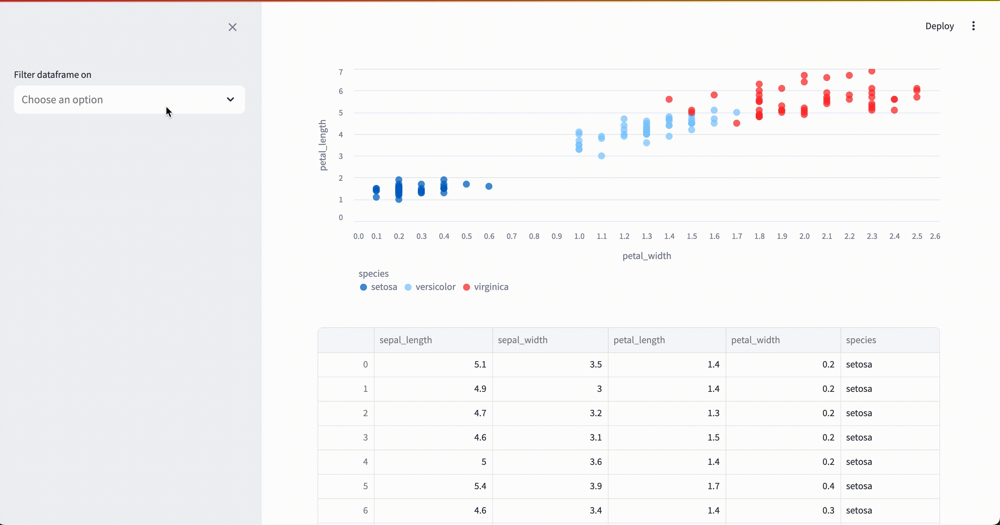

# Streamlit Data Plot

Provides a UI to select channels from a pandas dataframe and generate a scatter
plot in a streamlit application.

## Installation

<!-- ```shell
pip install st-dataplot
``` -->

From source:

```shell
git clone https://github.com/maxwelllevin/st-dataplot.git
cd st-dataplot
pip install .
```

## Usage



Code:

```python
import pandas as pd
import seaborn as sns  # pip install seaborn
import streamlit as st

from st_dataplot import ScatterConfig

df = sns.load_dataset("iris")
df["species"] = pd.Categorical(df["species"])

with st.sidebar:
    cfg = ScatterConfig.from_ui(df)

with st.container(border=False):
    fig = cfg.make_fig(df)
    cfg.display(fig, filename="iris-plot.png")

st.dataframe(df, use_container_width=True)
```
